# BÁO CÁO LAB 6 - VUEJS

| Bài tập | Code xử lý (Source) | Kết quả chạy (Result) |
| :--- | :--- | :--- |
| **Bài 1** Conditional Rendering | 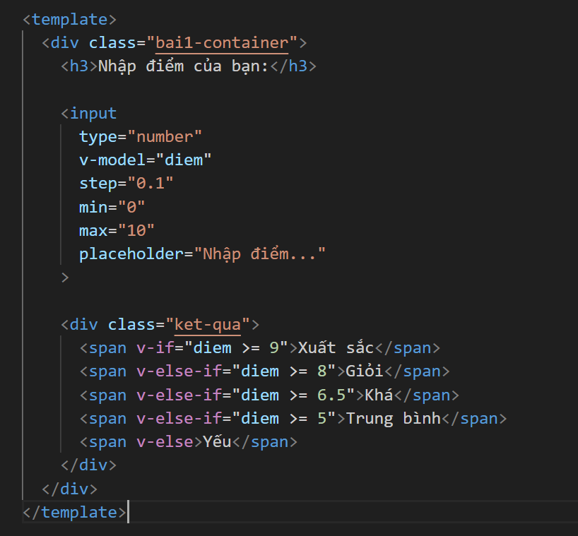 | 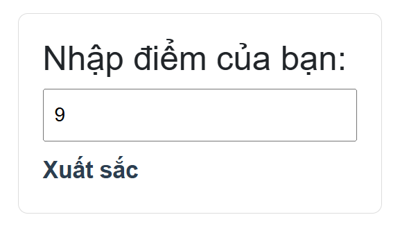 |
| **Bài 2** Các mùa trong năm | 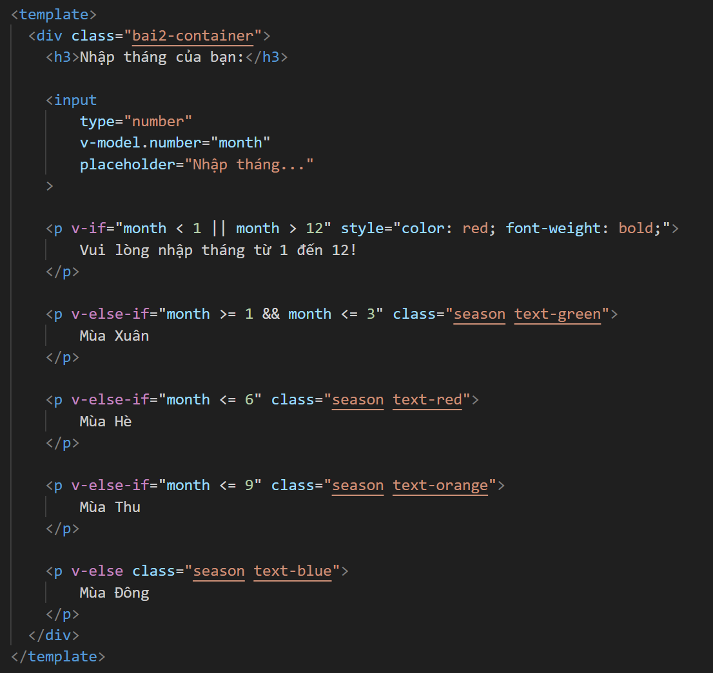 | 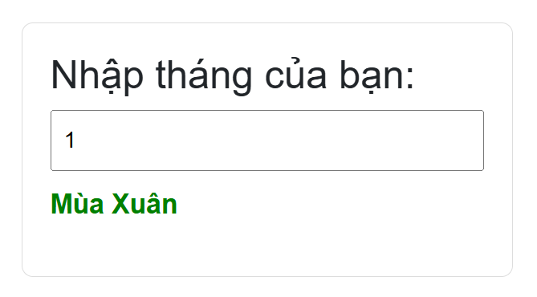 |
| **Bài 3** List Rendering | 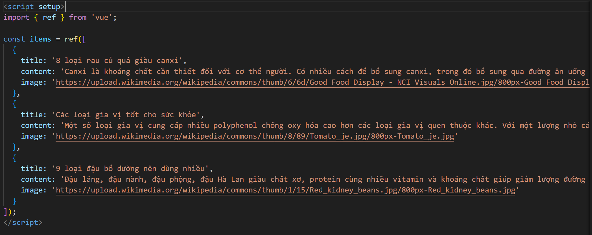 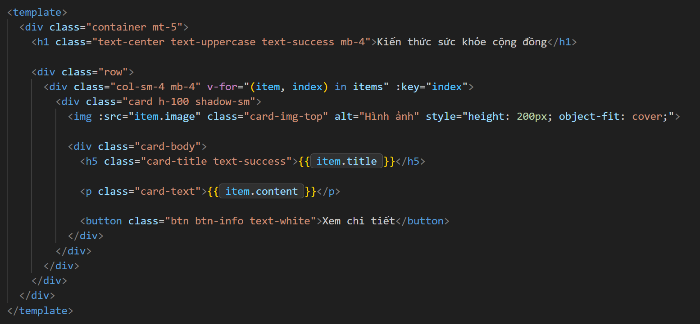 | 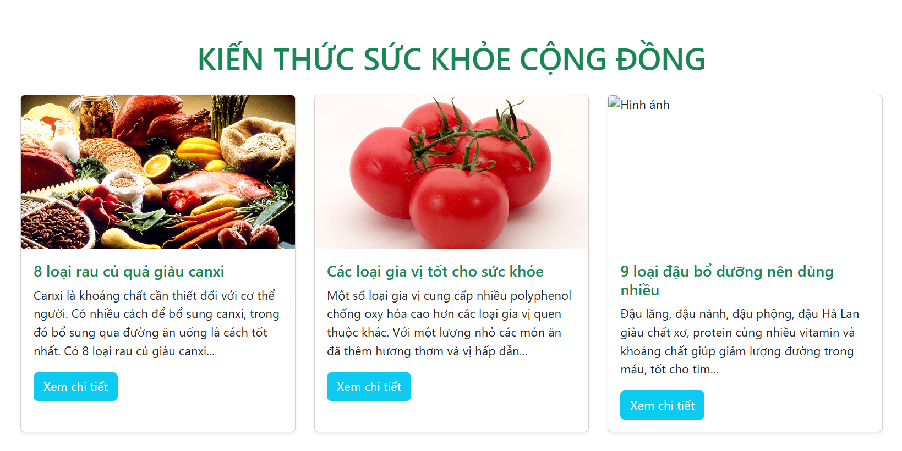 |
| **Bài 4** CRUD Học sinh | 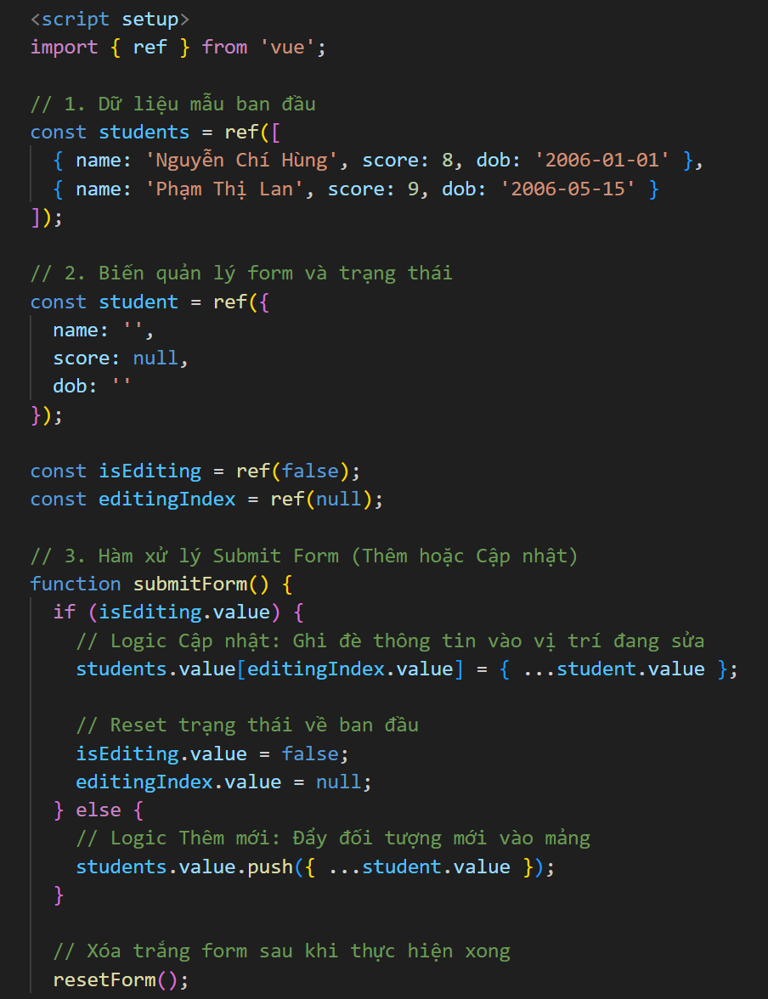 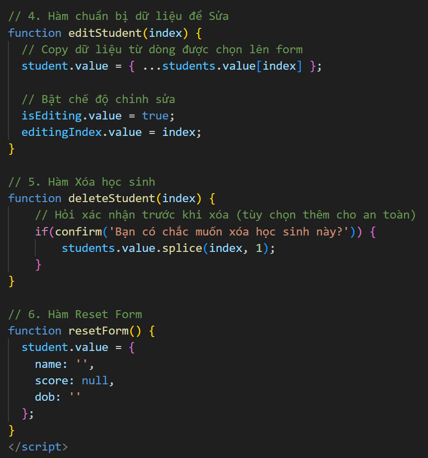 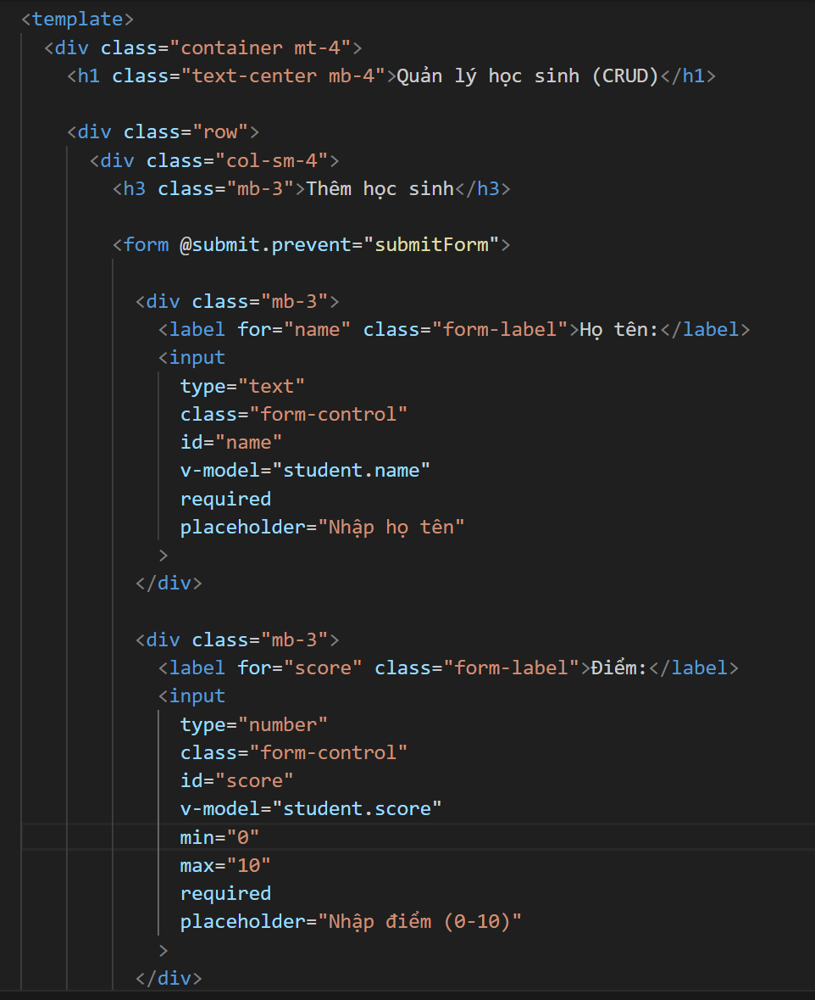 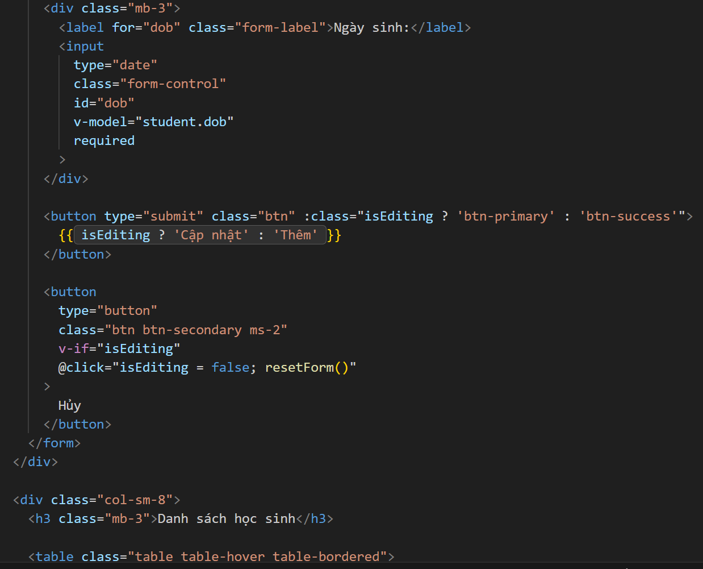 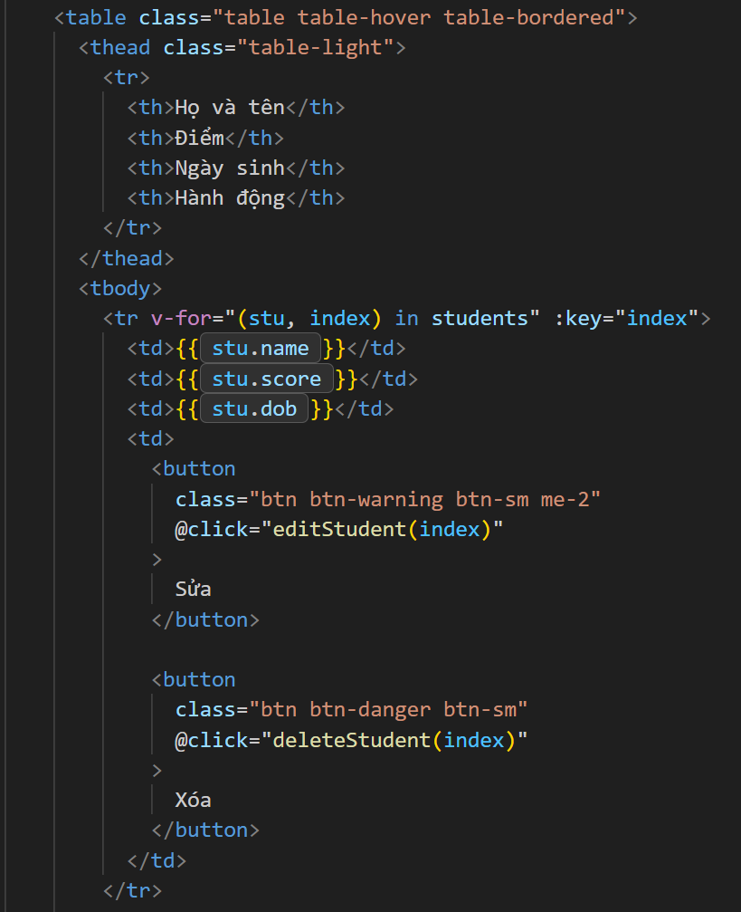 | 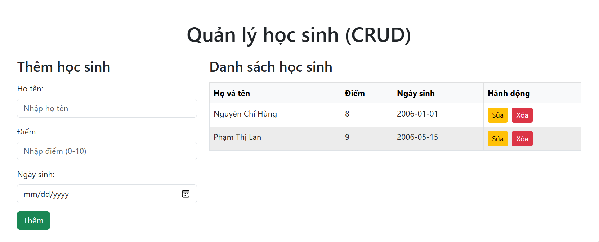 |